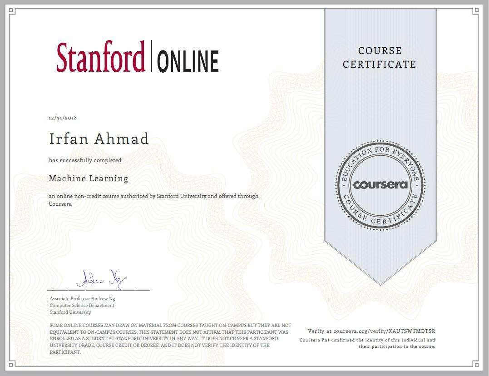
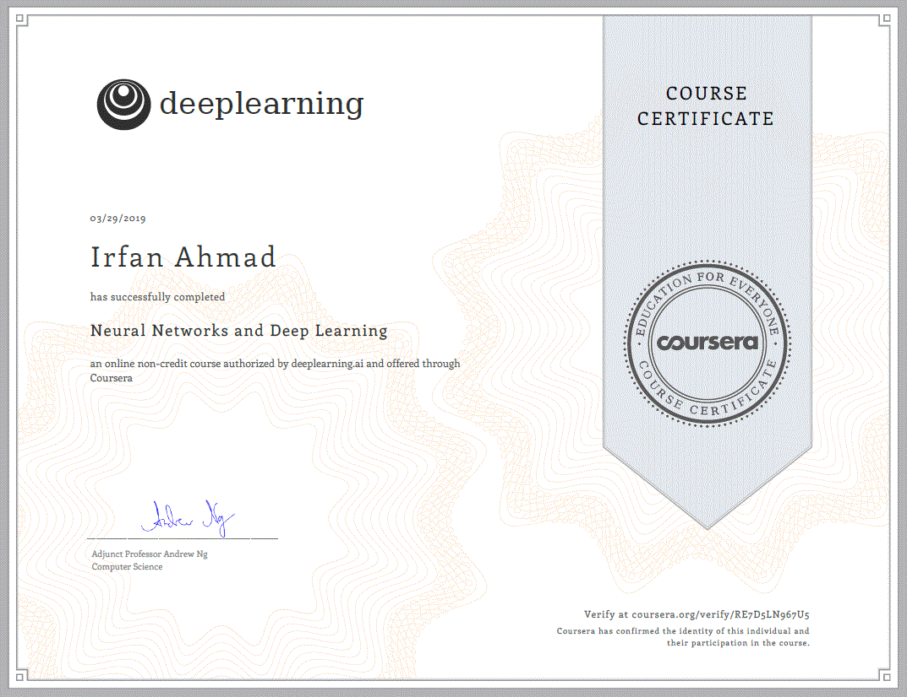
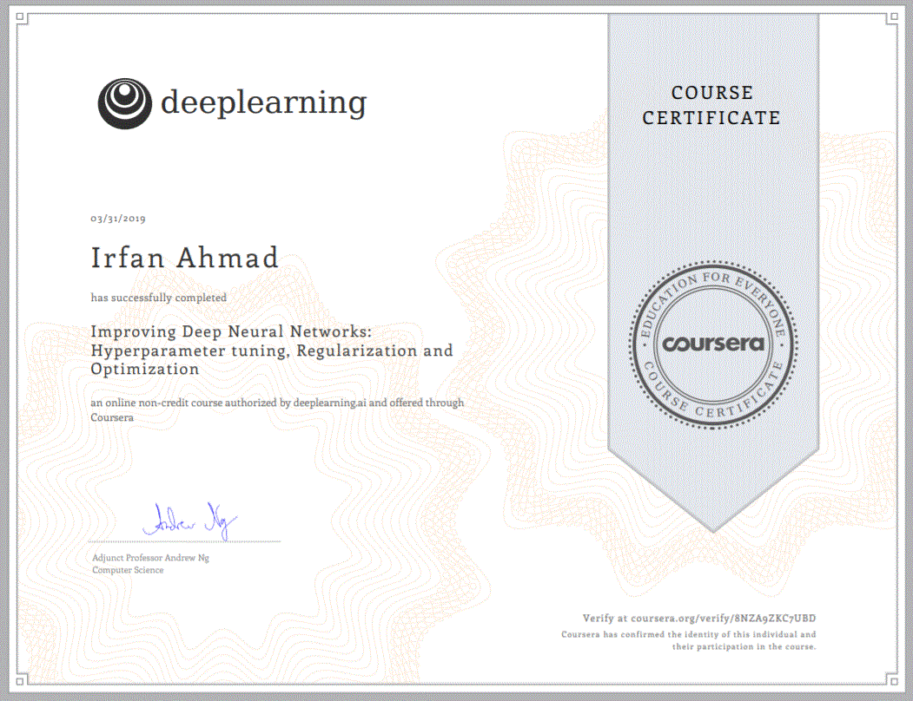
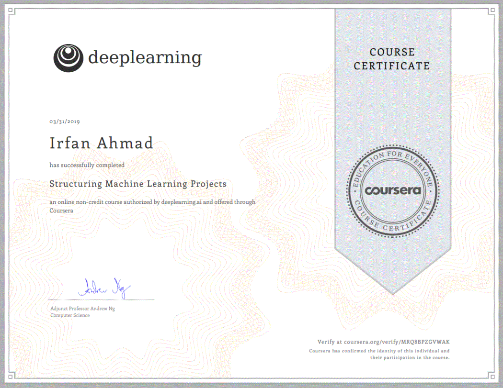
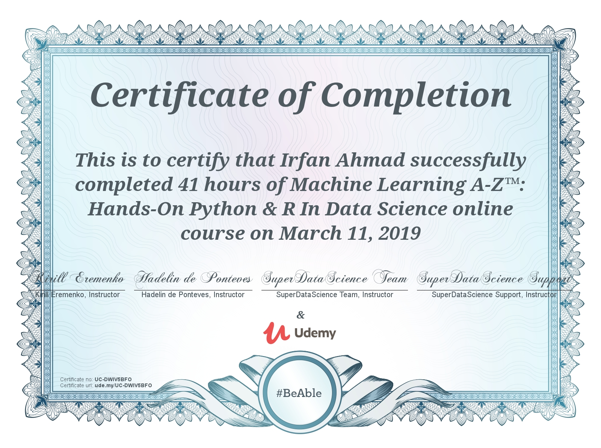

## Portfolio

---

### About Irfan 

Irfan has Strong Software Engineering + Data Science background.

He has experience in Statistical Modeling ,Deep Learning (ANN, CNN,RNN,RNN+LSTM/GRU etc), Transfer learning and Clustering.

He has good understanding of machine learning algorithm like Linear Regression, Logistic Regression, SVR/SVM, Decision Tree, Random Forest, Bagging/Boosting Technique etc.

He has experience in frameworks like TensorFlow, Keras and Scikit-Learn.

He has exposure to Full-Stack Machine Learning ranging from Design to Deployment.

He has solid understanding of ML pipelines: data processing, feature extraction, modelling, training, deployment, A/B Testing ,monitoring.

Irfan has previous experience is in SAP products development and support including CRM, ERP and E-commerce.

Programming experience -Python, MATLAB, R, Java, ABAP

---

### CERTIFICATIONS

---

Page template forked from <a href="https://github.com/evanca/quick-portfolio">evanca</a>

<!-- Remove above link if you don't want to attibute -->
